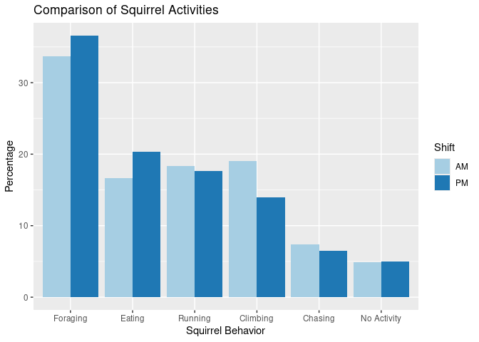
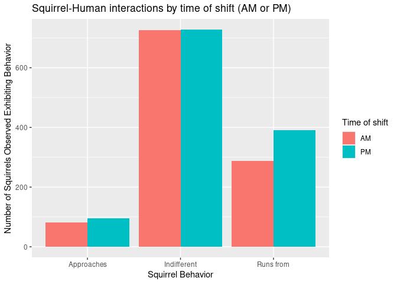

Project memo
================
Team name

``` r
library(tidyverse)
library(broom)
library(readxl)
library(leaflet)
library(RColorBrewer)
library(htmlwidgets)

squirrels <- read_csv("../data/2018_Central_Park_Squirrel_Census_-_Squirrel_Data.csv")
```

## Loading the RColorBrewer pallette “Paired,” which includes pairs of light

## and dark shades.

``` r
my_colors <- brewer.pal(n = 4, name = "Paired")
```

### Final Plot 1 - Leaflet Map:

To build the leaflet map, the first step was to create separate
variables for the latitude and longitude, as both were combined in the
original dataset. This was the most intensive data cleaning necessary
for the project. The code then generates the base OpenStreetMap layer,
as well as grouped circle markers for each squirrel.

``` r
# Cleaning the strange formatting from the original dataset
squirrels <- squirrels |>
  mutate(lng = substring(`Lat/Long`, 8, 22),
         lat = substring(`Lat/Long`, 26, 40))
squirrels$lng <- as.numeric(squirrels$lng)
```

    ## Warning: NAs introduced by coercion

``` r
squirrels$lat <- as.numeric(squirrels$lat)
```

    ## Warning: NAs introduced by coercion

``` r
# Resolving an issue with the substring function that sent 200 squirrels to 
# Colombia
squirrels <- squirrels |>
  mutate(
    lat = if_else(
      condition = lat < 10,
      true = lat + 40,
      false = lat
    )
  )

# Generating the leaflet map
squirrels_map <- leaflet(squirrels) |>
  addTiles() |>
  setView(lng = -73.9651,
          lat = 40.7833,
          zoom = 13) |>
  addCircleMarkers(lat = ~lat, 
             lng = ~lng, 
             clusterOptions = markerClusterOptions(),
             color = squirrels$`Primary Fur Color`,
             fillColor = squirrels$`Primary Fur Color`,
             popup = squirrels$`Unique Squirrel ID`)
```

    ## Warning in validateCoords(lng, lat, funcName): Data contains 81 rows with
    ## either missing or invalid lat/lon values and will be ignored

``` r
# Saving the HTML widget
saveWidget(squirrels_map, file = "index.html", selfcontained = TRUE)
```

# The following bar plot compares the frequency of squirrel activities in the AM \# and PM shifts.

``` r
# Creating a "No Activity" variable
activities <- squirrels |>
  mutate("No Activity" = case_when (Running == FALSE & 
                                    Chasing == FALSE & 
                                    Climbing == FALSE & 
                                    Eating == FALSE & 
                                    Foraging == FALSE
                                    ~ TRUE,
                                  )) |>
  
# Counting the number of squirrels observed doing each activity
  select(Shift, Running, Chasing, Climbing, Eating, Foraging, "No Activity") |>
  pivot_longer(
    cols = c(Running, Chasing, Climbing, Eating, Foraging, "No Activity"),
    names_to = "Activity",
    values_to = "Observed"
  ) |>
  filter(Observed == TRUE) |>
  count(Activity, Shift, name = "Frequency") |>
  group_by(Activity) |>
  mutate(Total_Frequency = sum(Frequency)) |>
  ungroup() |>
  
# Expressing with percentages
  group_by(Shift) |>
  mutate(Percent = (100*(Frequency / sum(Frequency)))) |>
  ungroup()

# Generating the plot with paired bars dividing the AM and PM shifts
ggplot(activities, aes(x = reorder(Activity, -Total_Frequency), 
                      y = Percent, fill = Shift)) +
  geom_col(position = "dodge") +
  labs(
    title = "Comparison of Squirrel Activities",
    x = "Squirrel Behavior",
    y = "Percentage"
  ) +
  
# Using a more distinctive color palette
  scale_fill_brewer(palette = "Paired")
```



``` r
# Saving the plot
  ggsave("squirrelActivity.png", plot = get_last_plot(), width = 6, height = 3)
```

# Similar to above, this bar plot discusses squirrel-human interactions, and is

# separated by the AM and PM shift.

#### Final Plot 3

``` r
squirrels %>%
  select(Shift, Approaches, Indifferent, `Runs from`) %>%
  pivot_longer(
    cols = c(Approaches, Indifferent, `Runs from`),
    names_to = "Interaction",
    values_to = "Observed"
  ) %>%
  filter(Observed == TRUE) %>%
  count(Shift, Interaction, name = "Frequency") %>%
  
  ggplot(aes(
    x = Interaction,
    y = Frequency,
    fill = Shift 
  )) +
  geom_col(position = "dodge") +
  labs(
    title = "Squirrel-Human interactions by time of shift (AM or PM)",
    x = "Squirrel Behavior",
    y = "Number of Squirrels Observed Exhibiting Behavior",
    fill = "Time of shift"
  ) 
```



``` r
ggsave("squirrelHumanActivity.png", plot = get_last_plot(), width = 6, height = 3)
```
