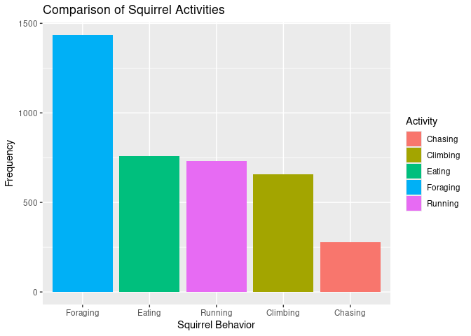

Project proposal
================
TDCJ

``` r
library(tidyverse)
library(broom)
library(readr)
# install.packages("leaflet")
library(leaflet)
squirrels <- read_csv("2018_Central_Park_Squirrel_Census_-_Squirrel_Data.csv")

#View(squirrels)
```

## 1. Introduction

The Squirrel Census is a project that was first done in October 2018
when a group of volunteers gathered to collect data on the squirrels of
New York City’s Central Park. The volunteers made observations about the
squirrels locations, physical characteristics, and behaviors.

The dataset contains 3023 observations and 31 variables. As we analyze
this dataset, we hope to better understand the squirrels of Central
Park. Some questions we are interested in answering include: 1. Are some
squirrels more likely to be foraging than others? 2. Are the squirrels
above ground more often in the morning or evening shift? 3. Is there a
variation in frequency of interaction with humans by age of the
squirrels?

## 2. Data

Text goes here. Place your data in the /data folder, and add dimensions
and codebook to the README in that folder. Then print out the output of
glimpse() or skim() of your data frame.

``` r
squirrels <- read_csv("2018_Central_Park_Squirrel_Census_-_Squirrel_Data.csv")
```

    ## Rows: 3023 Columns: 31
    ## ── Column specification ────────────────────────────────────────────────────────
    ## Delimiter: ","
    ## chr (14): Unique Squirrel ID, Hectare, Shift, Age, Primary Fur Color, Highli...
    ## dbl  (4): X, Y, Date, Hectare Squirrel Number
    ## lgl (13): Running, Chasing, Climbing, Eating, Foraging, Kuks, Quaas, Moans, ...
    ## 
    ## ℹ Use `spec()` to retrieve the full column specification for this data.
    ## ℹ Specify the column types or set `show_col_types = FALSE` to quiet this message.

``` r
glimpse(squirrels)
```

    ## Rows: 3,023
    ## Columns: 31
    ## $ X                                            <dbl> -73.95613, -73.96886, -73…
    ## $ Y                                            <dbl> 40.79408, 40.78378, 40.77…
    ## $ `Unique Squirrel ID`                         <chr> "37F-PM-1014-03", "21B-AM…
    ## $ Hectare                                      <chr> "37F", "21B", "11B", "32E…
    ## $ Shift                                        <chr> "PM", "AM", "PM", "PM", "…
    ## $ Date                                         <dbl> 10142018, 10192018, 10142…
    ## $ `Hectare Squirrel Number`                    <dbl> 3, 4, 8, 14, 5, 3, 2, 2, …
    ## $ Age                                          <chr> NA, NA, NA, "Adult", "Adu…
    ## $ `Primary Fur Color`                          <chr> NA, NA, "Gray", "Gray", "…
    ## $ `Highlight Fur Color`                        <chr> NA, NA, NA, NA, "Cinnamon…
    ## $ `Combination of Primary and Highlight Color` <chr> "+", "+", "Gray+", "Gray+…
    ## $ `Color notes`                                <chr> NA, NA, NA, "Nothing sele…
    ## $ Location                                     <chr> NA, NA, "Above Ground", N…
    ## $ `Above Ground Sighter Measurement`           <chr> NA, NA, "10", NA, NA, NA,…
    ## $ `Specific Location`                          <chr> NA, NA, NA, NA, "on tree …
    ## $ Running                                      <lgl> FALSE, FALSE, FALSE, FALS…
    ## $ Chasing                                      <lgl> FALSE, FALSE, TRUE, FALSE…
    ## $ Climbing                                     <lgl> FALSE, FALSE, FALSE, FALS…
    ## $ Eating                                       <lgl> FALSE, FALSE, FALSE, TRUE…
    ## $ Foraging                                     <lgl> FALSE, FALSE, FALSE, TRUE…
    ## $ `Other Activities`                           <chr> NA, NA, NA, NA, NA, NA, N…
    ## $ Kuks                                         <lgl> FALSE, FALSE, FALSE, FALS…
    ## $ Quaas                                        <lgl> FALSE, FALSE, FALSE, FALS…
    ## $ Moans                                        <lgl> FALSE, FALSE, FALSE, FALS…
    ## $ `Tail flags`                                 <lgl> FALSE, FALSE, FALSE, FALS…
    ## $ `Tail twitches`                              <lgl> FALSE, FALSE, FALSE, FALS…
    ## $ Approaches                                   <lgl> FALSE, FALSE, FALSE, FALS…
    ## $ Indifferent                                  <lgl> FALSE, FALSE, FALSE, FALS…
    ## $ `Runs from`                                  <lgl> FALSE, FALSE, FALSE, TRUE…
    ## $ `Other Interactions`                         <chr> NA, NA, NA, NA, NA, NA, N…
    ## $ `Lat/Long`                                   <chr> "POINT (-73.9561344937861…

## 3. Data analysis plan

Text goes here. - What variables will you visualize to explore your
research questions? - Will there be any other data that you need to find
to help with your research question? - Very preliminary exploratory data
analysis, including some summary statistics and visualizations, along
with some explanation on how they help you learn more about your data.
(You can add to these later as you work on your project.) - The data
visualization(s) that you believe will be useful in exploring your
question(s). (You can update these later as you work on your project.)

``` r
squirrels <- read_csv("2018_Central_Park_Squirrel_Census_-_Squirrel_Data.csv") |>
  select(Running, Chasing, Climbing, Eating, Foraging) |>
  pivot_longer(
    cols = everything(),
    names_to = "Activity",
    values_to = "Observed"
  ) |>
  filter(Observed == TRUE) |>
  count(Activity, name = "Frequency")
```

    ## Rows: 3023 Columns: 31
    ## ── Column specification ────────────────────────────────────────────────────────
    ## Delimiter: ","
    ## chr (14): Unique Squirrel ID, Hectare, Shift, Age, Primary Fur Color, Highli...
    ## dbl  (4): X, Y, Date, Hectare Squirrel Number
    ## lgl (13): Running, Chasing, Climbing, Eating, Foraging, Kuks, Quaas, Moans, ...
    ## 
    ## ℹ Use `spec()` to retrieve the full column specification for this data.
    ## ℹ Specify the column types or set `show_col_types = FALSE` to quiet this message.

``` r
ggplot(squirrels, aes(x = reorder(Activity, -Frequency), y = Frequency, fill = Activity)) +
  geom_col() +
  labs(
    title = "Comparison of Squirrel Activities",
    x = "Squirrel Behavior",
    y = "Frequency"
  ) 
```

<!-- -->
